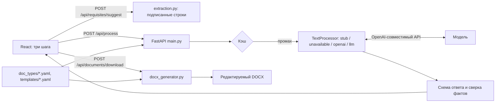

# Документ за 3 шага

Веб-сервис превращает черновой текст в готовый служебный документ Word. Пользователь
вставляет черновик, выбирает тип документа и оформление, проверяет реквизиты и скачивает
редактируемый DOCX. Модель исправляет орфографию и приводит текст к официально-деловому
стилю. Сервис сверяет её ответ с черновиком: реквизит с неподтверждённой датой, суммой
или именем остаётся пустым, а такие сведения в тексте помечаются предупреждением.
Оформление файла задают YAML-шаблоны, а не модель. Поддерживаются четыре
типа документов (служебная записка, докладная записка, информационная справка, письмо) и два
оформления («Классический корпоративный» и «Современный регламентный»). В редакторе можно
создать своё оформление.

**Рабочий стенд: <https://doc3.codeboom.pro>.** Регистрация не нужна. На стенде включена
обработка текста моделью (режим `llm`). Подготовка документа (`POST /api/process`) ограничена
20 запросами в минуту с одного адреса, допускается всплеск до 5 запросов. Если сервис ответил
кодом 429, подождите 20 секунд и повторите.

## Презентация проекта

Выберите удобный формат, чтобы быстро познакомиться с проектом:

- [Смотреть видео-презентацию](https://disk.yandex.ru/i/gEjXfb2RI-ojUQ) — краткий обзор работы сервиса.
- [Открыть PDF-презентацию](https://github.com/chebupeka/BRYANSK_BGITU_1/blob/main/docs/presentation/presentation.pdf) — описание решения и ключевых возможностей в слайдах.

## Содержание

- [Презентация проекта](#презентация-проекта)
- [Быстрый запуск](#быстрый-запуск)
- [Проверка без затрат](#проверка-без-затрат)
- [Обработка текста моделью](#обработка-текста-моделью)
- [Проверка сценариев 1–7](#проверка-сценариев-17)
- [Демонстрационные данные](#демонстрационные-данные)
- [Стек и структура проекта](#стек-и-структура-проекта)
- [Переменные окружения](#переменные-окружения)
- [Ключи доступа](#ключи-доступа)
- [Логика работы с ИИ](#логика-работы-с-ии)
- [Как добавить тип документа или оформление](#как-добавить-тип-документа-или-оформление)
- [Документация в репозитории](#документация-в-репозитории)
- [Проверки](#проверки)
- [Реализованные функции](#реализованные-функции)
- [Известные ограничения](#известные-ограничения)

## Быстрый запуск

Нужен Docker Engine с плагином Compose. Из корня репозитория:

```sh
docker compose up --build
```

Для первого запуска не нужны ни `.env`, ни ключи, ни модель.

| Что | Адрес |
| --- | --- |
| Интерфейс (nginx со сборкой frontend, `/api` проксируется в backend) | <http://localhost:8080> |
| Swagger UI backend | <http://localhost:8000/docs> |
| Проверка работы API | <http://localhost:8000/api/health> |
| Проверка готовности конфигурации | <http://localhost:8000/api/ready> |

Оба порта открыты только на `127.0.0.1` (см. [compose.yaml](compose.yaml)). Остановить сервис:
`docker compose down`.

Сквозная проверка работающих контейнеров через nginx, модель не вызывается:

```sh
python scripts/check_docker.py
```

По умолчанию запускается режим `stub`. Весь путь до DOCX в нём работает без ключей и сети:
реквизиты, шаблоны, метки пропусков, скачивание файла. Текст в этом режиме переносится
без исправлений. В шапке интерфейса стоит отметка «Демо-режим», а на третьем шаге появляется
предупреждение об этом. Исправление текста включается режимом `llm` (см. следующий раздел).

## Проверка без затрат

Платных внешних API в решении нет: проверка не требует расходов и своих ключей. Достаточно
любого из трёх способов.

| Способ | Что нужно | Что можно посмотреть |
| --- | --- | --- |
| Рабочий стенд <https://doc3.codeboom.pro> | Браузер. Регистрация и ключи не нужны | Все сценарии, включая исправление текста моделью |
| `docker compose up --build` | Docker | Сценарии 1, 3, 5, 6 и 7 — весь путь до DOCX без ключей и без сети |
| Профиль `ollama` в Compose | Docker и около 5 ГБ на диске под модель | Все сценарии на своей машине: открытая модель `qwen2.5:7b-instruct` скачивается бесплатно |

Ключ провайдера нужен только тому, кто захочет подключить внешнюю модель вместо локальной,
и на оценку решения это не влияет — см. [Ключи доступа](#ключи-доступа). Автотесты и проверки
в CI тоже идут без сети и без ключей: модель в них подменяется.

## Обработка текста моделью

Backend работает с любым сервером, который поддерживает OpenAI-совместимый API: локальной
открытой моделью через Ollama или внешним провайдером. Запрос уходит на
`{LLM_BASE_URL}/chat/completions`.

Режимы `TEXT_PROCESSOR`:

| Значение | Что делает |
| --- | --- |
| `stub` | По умолчанию. Без модели: непустые строки черновика переносятся дословно |
| `unavailable` | Каждая подготовка документа отвечает ошибкой 503. Режим нужен, чтобы проверить сценарий 6 |
| `openai` | Проверка связи с моделью. Политика `PreserveSourcePolicy` пропускает только дословный исходный текст |
| `llm` | Рабочий режим: исправление текста, заполнение реквизитов, сверка фактов с черновиком |

Подключение модели:

1. Скопируйте `.env.example` в `.env` (`cp .env.example .env`).
2. Задайте в `.env`:

   ```dotenv
   TEXT_PROCESSOR=llm
   LLM_BASE_URL=http://host.docker.internal:11434/v1
   LLM_MODEL=qwen2.5:7b-instruct
   LLM_API_KEY=
   LLM_TIMEOUT_SECONDS=120
   ```

   `host.docker.internal` — адрес компьютера, на котором запущен Docker, если смотреть
   из контейнера backend. Если backend запущен без Docker, укажите
   `http://localhost:11434/v1`. Для внешнего провайдера укажите его base URL, оканчивающийся
   на `/v1`, и ключ в `LLM_API_KEY`. Имя модели должно совпадать с моделью, которая есть
   у выбранного сервера.
3. Пересоздайте контейнеры, чтобы они прочитали новые настройки:

   ```sh
   docker compose up -d --force-recreate
   ```

4. Проверьте связь с моделью на одном черновике. Скрипт берёт `LLM_BASE_URL` и `LLM_MODEL`
   из `.env`:

   ```sh
   python scripts/check_llm.py
   ```

`/api/ready` проверяет только локальную конфигурацию и к модели не обращается. Если в режиме
`openai` или `llm` не задан `LLM_MODEL`, он отвечает 503. Доступность модели и ключа
проверяет реальный запрос `/api/process`.

### Ollama внутри Compose

Сервис `ollama` описан в профиле `ollama`: по умолчанию он не запускается и модели сам
не скачивает.

```sh
docker compose --profile ollama up -d ollama
docker compose --profile ollama exec ollama ollama pull qwen2.5:7b-instruct
```

В `.env` задайте `TEXT_PROCESSOR=llm`, `LLM_MODEL=qwen2.5:7b-instruct` и
`LLM_BASE_URL=http://ollama:11434/v1`. Затем выполните:

```sh
docker compose --profile ollama up --build -d --wait
```

Модели хранятся в томе `ollama_models`, порт 11434 открыт только на `127.0.0.1`. Остановить
всё вместе с Ollama: `docker compose --profile ollama down`. Как использовать модель
на другом компьютере и что учесть при размещении сервиса на сервере, описано
в [docs/REMOTE_MODEL.md](docs/REMOTE_MODEL.md) и [docs/DEPLOY.md](docs/DEPLOY.md).

## Проверка сценариев 1–7

Интерфейс состоит из главной страницы, каталога и трёх шагов работы. Шаги показаны в шапке:
**Черновик → Тип и реквизиты → Готовый файл**. Справа на всех трёх шагах виден лист A4.
Над листом переключатель режимов: «Лист» (просмотр), «Текст» (правка прямо на листе)
и «Оформление» (выбор шаблона). Черновик, выбранный тип, оформление и реквизиты хранятся
в `localStorage` браузера и сохраняются после перезагрузки страницы.

На первом шаге над полем ввода есть готовые примеры: «Служебная записка», «Докладная записка»,
«Информационная справка», «Письмо» и «Черновик с опечатками». Организации, люди и суммы
в примерах вымышлены. Ещё 20 черновиков с описанием ожидаемого результата лежат
в [examples/drafts](examples/drafts) (описание — в
[manifest.yaml](examples/drafts/manifest.yaml)). Файл `.txt` можно перетащить в поле
черновика.

Сценарии 2 и 4 требуют модели: они проходят на стенде или локально в режиме `llm`.
Сценарии 1, 3, 5, 6 и 7 проходят и в режиме `stub`.

### Сценарий 1. Три шага с корректным текстом

1. На главной нажмите «Создать документ». На шаге «Черновик» выберите пример
   «Служебная записка» и нажмите «Выбрать тип документа».
2. На шаге «Тип и реквизиты» выберите тип «Служебная записка» и оформление
   «Классический корпоративный». Раздел «Реквизиты» показывает только поля, которых
   не нашлось в черновике. Заполните их или оставьте пустыми. Нажмите
   «Подготовить документ».
3. На шаге «Готовый файл» нажмите «Скачать DOCX».

Ожидаемый результат: браузер сохраняет файл `service_memo-classic.docx`, и появляется
сообщение «Файл … передан браузеру». Файл открывается в Word, весь текст в нём
редактируется. Оформление по [classic.yaml](backend/app/templates/classic.yaml):
Times New Roman 14 пт, межстрочный интервал 1,5, поля 20/15/20/30 мм, отступ первой строки
12,5 мм, текст выровнен по ширине. Адресат стоит блоком справа, организация в верхнем
колонтитуле, номер страницы в нижнем. Порядок реквизитов задаёт
[01_service_memo.yaml](backend/app/doc_types/01_service_memo.yaml).

### Сценарий 2. Исправление орфографии и стиля

1. На шаге «Черновик» выберите пример «Черновик с опечатками». В нём двойные пробелы,
   «темпиратура», капс и список через «надо». Нажмите «Выбрать тип документа», затем
   «Подготовить документ».

Ожидаемый результат (режим `llm`): текст на листе переписан деловым стилем, опечатки
исправлены. Блок «Что изменил обработчик · N» перечисляет правки, например
«темпиратура» → «Температура…» и «- надо» → «Необходимо». Список правок сервис строит
сам, сравнивая исходный и итоговый текст, а не со слов модели. Другие черновики
с разговорной речью: `examples/drafts/*_02_colloquial.txt`.

### Сценарий 3. Недостающие реквизиты

1. Возьмите тот же пример «Черновик с опечатками». В нём подписан только подписант
   («подпись: Сидоров С.С.»).
2. На шаге «Тип и реквизиты» появится сообщение «Найдено в черновике: Подписант». Ниже
   откроются поля остальных реквизитов, обязательные отмечены звёздочкой. Под ними
   предупреждение «Не заполнено: …» с пояснением «Можно продолжить — в документе
   останутся метки».
3. Введите, например, «Дата», а «Кому» оставьте пустым. Нажмите «Подготовить документ»,
   затем «Скачать DOCX».

Ожидаемый результат: сервис не подставляет значения, которых нет ни в черновике, ни в форме.
На шаге «Готовый файл» видно предупреждение «Остались пустыми: …» с кнопкой «Заполнить»,
которая возвращает к форме. В файле введённая дата стоит на своём месте, а на месте
пустого обязательного поля стоит метка `[Заполнить: Кому]`. Пустые необязательные поля
в файл не попадают.

### Сценарий 4. Сохранение фактов и смысла

1. Вставьте в черновик текст из [examples/typos.txt](examples/typos.txt). В нём есть сумма
   «30 000 рублей», срок «25.09.2026», имя «Иванов И. И.» и условие «только если бюджет
   согласуют».
2. Выберите тип, нажмите «Подготовить документ».

Ожидаемый результат (режим `llm`): формулировки стали деловыми, а сумма, дата, фамилия
и условие сохранились. Промпт запрещает выводить дату документа из срока. Если в ответе
модели появилось сведение, которого нет в черновике, или пропала оговорка, на шаге
«Готовый файл» появится предупреждение. Например: «Проверьте текст перед отправкой:
в нём есть сведения, которых нет в черновике — …» или «Проверьте смысл: из черновика
пропали …». Реквизит с неподтверждённым значением остаётся пустым и получает метку.

### Сценарий 5. Разные типы документов и шаблоны

1. По очереди выберите примеры «Служебная записка», «Докладная записка», «Информационная
   справка» и «Письмо». Для каждого подготовьте и скачайте документ.
2. Для одного из документов на шаге «Готовый файл» переключите лист в режим «Оформление»
   и выберите «Современный регламентный». Скачайте файл ещё раз.

Ожидаемый результат: у каждого типа свой заголовок («СЛУЖЕБНАЯ ЗАПИСКА», «ДОКЛАДНАЯ
ЗАПИСКА», «ИНФОРМАЦИОННАЯ СПРАВКА», «ПИСЬМО») и свой набор реквизитов (см. таблицу
[ниже](#как-добавить-тип-документа-или-оформление)). После смены оформления обработка
не запускается заново: над выбором оформления написано «Содержание не изменится,
повторная обработка не нужна». Второй файл содержит тот же текст в оформлении
[modern.yaml](backend/app/templates/modern.yaml): Arial 12 пт, интервал 1,15,
поля 15/20/15/25 мм, «Кому / От кого» таблицей, тема полужирным, подпись по центру,
в нижнем колонтитуле название документа и дата.

### Сценарий 6. Обработка ошибок

Сценарий проверяется в локальном запуске: режим `unavailable` имитирует недоступную модель.

1. Включите режим отказа и пересоздайте контейнеры:

   ```sh
   TEXT_PROCESSOR=unavailable docker compose up -d --force-recreate
   ```

2. Обновите страницу. В шапке появится отметка «Обработчик выключен». Вставьте черновик
   и нажмите «Подготовить документ».
3. Ожидаемый результат: страница не зависает и не сообщает об успехе. Появляется ошибка
   «Обработка временно недоступна. Черновик сохранён в форме.» с подсказкой, номером
   запроса и кнопкой «Повторить». Черновик и реквизиты остаются в форме, файл
   не создаётся.
4. Верните обычный режим командой `docker compose up -d --force-recreate` и нажмите
   «Повторить». Документ подготовится.

Проверка того же без браузера:
`python scripts/check_docker.py --expected-mode unavailable`. Ошибки модели в режиме `llm`
(таймаут, нет связи, ответ не по схеме) выводятся тем же блоком, у каждой своя подсказка.

### Сценарий 7 (дополнительный). Предпросмотр и ручная правка

1. Подготовьте любой документ. На шаге «Готовый файл» лист справа открыт в режиме «Текст»
   с подписью «Редактирование на листе · нажмите на текст или реквизит».
2. Щёлкните по абзацу или реквизиту на листе и измените его. На панели над листом можно
   поменять шрифт, размер, начертание, выравнивание, межстрочный интервал, интервал после
   абзаца и отступ первой строки. Кнопка «Сбросить» возвращает оформление шаблона.
3. Нажмите «Скачать DOCX».

Ожидаемый результат: в файле текст и реквизиты с вашими правками, форматирование
основного текста применено. На первых двух шагах правки на листе тоже сохраняются
в черновике и реквизитах.

Своё оформление: откройте «Каталог» и нажмите «Создать оформление». В окне «Подробный
редактор оформления» задайте шрифт, поля, интервалы, вид адресата, выравнивание подписи
и колонтитулы, затем нажмите «Сохранить оформление». Новое оформление появится в списке
на шаге «Тип и реквизиты». Оно хранится в браузере, а при скачивании backend проверяет
его параметры по той же схеме `Template`, что и встроенные шаблоны.

## Демонстрационные данные

| Где | Что это |
| --- | --- |
| Первый шаг интерфейса | Пять черновиков в один клик: четыре типа документов и «Черновик с опечатками» |
| [examples/drafts](examples/drafts) | 20 черновиков разного качества: по каждому типу структурированный, разговорный, неполный и «в одну строку», плюс краевые случаи — одна строка, опечатки и шум, смешанные алфавиты, разные форматы чисел |
| [examples/drafts/manifest.yaml](examples/drafts/manifest.yaml) | Ожидаемый результат для каждого черновика: тип документа, какие реквизиты должны найтись, какие остаться пустыми, что обязано сохраниться в тексте |
| [examples/generated](examples/generated) | 13 готовых DOCX по этим черновикам, снятых со стенда в режиме `llm`. В [README каталога](examples/generated/README.md) для каждого сказано, на что смотреть: какие реквизиты остались метками и какие обороты переписаны |
| [examples/typos.txt](examples/typos.txt) | Черновик со сроком, суммой, фамилией и оговоркой — для сценария 4 |
| [examples/reference/case_reference.yaml](examples/reference/case_reference.yaml) | Эталонный перечень реквизитов по типам документов |
| [examples/api.http](examples/api.http), [service_memo.json](examples/service_memo.json), [missing_requisites.json](examples/missing_requisites.json) | Готовые запросы к API |

Организации, люди, суммы и номера в примерах вымышлены. Любой `.txt` из `examples/drafts`
перетаскивается прямо в поле черновика: три шага — и получается документ, соответствующий
этому черновику. Готовые пары «черновик → документ» лежат в
[examples/generated](examples/generated): документы сняты тем же путём, что проходит
пользователь, реквизиты вручную не дописывались. Восемь документов из 20 туда не вошли —
в них модель изменила смысл или дописала сведения; что именно, перечислено там же.
Перегенерировать их можно скриптом
[scripts/generate_examples.py](scripts/generate_examples.py). Автоматическая сверка
черновиков с ожиданиями из `manifest.yaml` описана в [docs/QA.md](docs/QA.md).

## Стек и структура проекта

- **Backend:** Python 3.12, FastAPI, Pydantic и pydantic-settings, httpx,
  python-docx 1.2.0, PyYAML, uvicorn. Проверки: pytest, ruff. Точные версии зависимостей
  зафиксированы в `backend/requirements.lock` и `backend/requirements-dev.lock`.
- **Frontend:** React 19, TypeScript 5.9, Vite 8, без UI-библиотек. В Docker сборку
  раздаёт nginx 1.28, он же проксирует `/api` в backend.
- **Модель:** любой сервер с OpenAI-совместимым API, например локальная открытая модель
  через Ollama (необязательный профиль Compose).
- **Хранение:** база данных не используется. Кэш результатов в памяти процесса, DOCX
  собирается в памяти запроса, черновик хранится в `localStorage` браузера.
- **Сборка и CI:** Dockerfile для backend и frontend, [compose.yaml](compose.yaml) для
  локального запуска, [compose.deploy.yaml](compose.deploy.yaml) для сервера за обратным
  прокси, GitHub Actions в [.github/workflows/checks.yml](.github/workflows/checks.yml).



```text
backend/
  app/
    main.py             сборка приложения, маршруты, CORS, ограничение параллельных обработок
    settings.py         чтение .env и проверка настроек
    schemas.py          контракты API: типы, реквизиты, шаблоны, запросы и ответы
    catalog.py          загрузка и проверка YAML типов и оформлений
    processing.py       интерфейс TextProcessor, режимы stub и unavailable, выбор режима
    llm.py              режим openai: транспорт и политика сохранения исходника
    content_policy.py   схема ответа модели и политика проверки содержания для режима openai
    llm_processor.py    режим llm: промпт, разбиение длинного черновика, сверка фактов
    extraction.py       разбор подписанных строк черновика в реквизиты, без модели
    dates.py            форматы дат, общие для разбора и сверки
    docx_generator.py   сборка DOCX по типу документа и оформлению
    ports.py            интерфейс генератора документа
    cache.py            ограниченный кэш подготовленного содержания
    errors.py           единый формат ошибок, Request ID
    doc_types/          четыре типа документов (YAML)
    templates/          два оформления (YAML)
  tests/                автотесты API, сценариев 1–6, корпуса черновиков, DOCX, режима llm
frontend/
  src/
    App.tsx             состояние и переходы между шагами
    api.ts              HTTP-вызовы, тексты ошибок, скачивание
    router.ts           маршруты /, /catalog, /draft, /options, /result
    storage.ts          localStorage: черновик, тема, свои оформления
    components/         шаги (DraftStep, OptionsStep, ReviewStep), лист (PreviewPane,
                        PagePreview), редактор оформления (TemplateEditor), шапка, элементы UI
    pages/              главная страница и каталог
    lib/                раскладка листа, готовые примеры (samples.ts), хуки
    gl/                 фоновая графика главной страницы
    generated/api.ts    типы API, генерируются из схем backend
  nginx.conf            раздача сборки, прокси /api, ограничение частоты /api/process
contracts/              openapi.json, api.ts, llm-output.schema.json (экспорт из backend)
examples/               api.http, drafts/ (20 черновиков + manifest.yaml),
                        generated/ (готовые DOCX по черновикам),
                        reference/case_reference.yaml, typos.txt, JSON-запросы к API
scripts/                check_docker.py, check_llm.py, export_contracts.py,
                        generate_examples.py, qa.py, qa_report.py, quality_report.py
docs/                   ARCHITECTURE.md, API.md, QA.md, DEPLOY.md, REMOTE_MODEL.md,
                        GIGACHAT.md, INTEGRATION.md, HANDOFF.md, presentation/
```

API: Swagger по адресу `/docs`, описание маршрутов и ошибок в [docs/API.md](docs/API.md),
готовые запросы в [examples/api.http](examples/api.http), зафиксированные контракты
в [contracts/](contracts/openapi.json).

| Маршрут | Назначение |
| --- | --- |
| `GET /api/health` | Проверка, что API работает; модель не вызывается |
| `GET /api/ready` | Готовность конфигурации, при отказе 503 |
| `GET /api/catalog` | Типы документов, реквизиты, оформления, текущий режим |
| `POST /api/requisites/suggest` | Реквизиты, прямо подписанные в черновике; модель не участвует |
| `POST /api/process` | Черновик и реквизиты → подготовленное содержание, недостающие поля, правки, предупреждения |
| `POST /api/documents/download` | Содержание и оформление → DOCX; модель не вызывается |

### Локальная разработка без Docker

Нужны Python 3.12–3.14 и Node.js 22.12 или новее. Backend, из корня репозитория:

```sh
cp .env.example .env
cd backend
python3 -m venv .venv
.venv/bin/python -m pip install -r requirements-dev.lock
.venv/bin/python -m pip install --no-deps -e .
.venv/bin/python -m uvicorn app.main:app --reload --host 127.0.0.1 --port 8000
```

В Windows вместо `.venv/bin/python` пишите `.venv/Scripts/python.exe`. Frontend, во втором
терминале:

```sh
cd frontend
npm ci
npm run dev
```

Интерфейс откроется на <http://localhost:5173>, Vite перенаправляет `/api` на backend.

## Переменные окружения

Все переменные перечислены в [.env.example](.env.example), проверяются при запуске
в [backend/app/settings.py](backend/app/settings.py). Значения секретов API не возвращает.
Если значение в Compose отличается от значения в `settings.py`, в таблице указаны оба.

| Переменная | По умолчанию | Назначение и допустимые значения |
| --- | --- | --- |
| `TEXT_PROCESSOR` | `stub` | Режим обработки: `stub`, `unavailable`, `openai`, `llm` |
| `APP_MODULE` | `app.main:app` | Приложение, которое запускает uvicorn в Compose. `settings.py` эту переменную не читает |
| `LLM_BASE_URL` | Compose и `.env.example`: `http://host.docker.internal:11434/v1`; `settings.py`: `http://localhost:11434/v1` | Base URL OpenAI-совместимого API, только HTTP(S), без логина в адресе и без query |
| `LLM_MODEL` | пусто | Имя модели, обязательно для `openai` и `llm`, до 200 символов |
| `LLM_API_KEY` | пусто | Ключ провайдера; для локальной модели можно не задавать |
| `LLM_TIMEOUT_SECONDS` | `20` | Сетевой таймаут запроса к модели, больше 0 и не больше 300. Локальной модели обычно нужно около 120. В `compose.deploy.yaml` по умолчанию 180 |
| `LLM_MAX_TOKENS` | `4096` | Предел длины ответа модели, от 128 до 65536 |
| `LLM_MAX_RETRIES` | `1` | `0` или `1`; повтор выполняется только при неверном ответе модели, не при сетевой ошибке |
| `LLM_RESPONSE_FORMAT` | `json_object` | `json_object` или `none`, если провайдер не поддерживает JSON mode |
| `CORS_ORIGINS` | Compose и `.env.example`: `[]`; `settings.py`: `["http://localhost:5173", "http://127.0.0.1:5173"]` | JSON-массив разрешённых origins. Через nginx или прокси Vite CORS не нужен |
| `CACHE_MAX_ENTRIES` | `128` | Размер кэша результатов, от 0 до 10000; `0` отключает кэш |
| `CACHE_TTL_SECONDS` | `300` | Время жизни записи в кэше, от 0 до 86400 секунд; `0` отключает кэш |
| `MAX_CONCURRENT_PROCESSES` | `4` | Сколько обработок идёт одновременно, от 1 до 128; сверх лимита API отвечает 503 |
| `PUBLIC_HOST` | `doc3.codeboom.su` | Только для `compose.deploy.yaml`: домен для обратного прокси |

Настройки применяются после перезапуска backend.

## Ключи доступа

Ключ нужен только для внешнего провайдера модели. Режимы `stub` и `unavailable`, а также
локальная модель через Ollama работают без ключей.

1. Скопируйте шаблон: `cp .env.example .env`. Файл `.env` закрыт в [.gitignore](.gitignore)
   и в репозиторий не попадает, а `.env.example` содержит только пустые заглушки.
2. Впишите в `.env` адрес провайдера, имя модели и ключ:

   ```dotenv
   TEXT_PROCESSOR=llm
   LLM_BASE_URL=https://<адрес провайдера>/v1
   LLM_MODEL=<имя модели у провайдера>
   LLM_API_KEY=<ключ>
   ```

   Адрес принимается только по HTTP(S), без логина в адресе и без query-параметров
   (проверка в [settings.py](backend/app/settings.py)). Имя модели должно совпадать с тем,
   как её называет провайдер.
3. Пересоздайте контейнеры, чтобы backend прочитал настройки:
   `docker compose up -d --force-recreate`. Compose подставляет значение из `.env`
   в переменные окружения контейнера; тот же порядок в
   [compose.deploy.yaml](compose.deploy.yaml), поэтому на сервере ключ задаётся окружением
   процесса, а файл `.env` туда копировать не нужно.
4. Проверьте связь одним черновиком: `python scripts/check_llm.py`.

Ключ уходит только на адрес из `LLM_BASE_URL`, в заголовке `Authorization: Bearer`. Наружу
он не возвращается: в настройках хранится как `SecretStr`, а `GET /api/health`,
`GET /api/ready` и `GET /api/catalog` сообщают лишь режим обработки. Ответы об ошибках
и логи не содержат ни ключа, ни ответа провайдера — в лог пишется только класс исключения
([errors.py](backend/app/errors.py)).

Смена провайдера — это правка `.env`, код менять не нужно: порядок действий и критерии
сравнения разобраны в [docs/GIGACHAT.md](docs/GIGACHAT.md), размещение на сервере —
в [docs/DEPLOY.md](docs/DEPLOY.md).

## Логика работы с ИИ

Подробное описание: [docs/ARCHITECTURE.md](docs/ARCHITECTURE.md), раздел о режиме `llm`.
Код: [backend/app/llm_processor.py](backend/app/llm_processor.py).

**Содержание отделено от оформления.** Модель получает только текст и реквизиты и отвечает
JSON вида `{"requisites": {...}, "body": ["абзац", ...]}`. Шрифты, поля, колонтитулы
и расположение реквизитов берутся из YAML-шаблона в `docx_generator.py`, модель на них
не влияет.

**Промпт.** Системный промпт (`SYSTEM_PROMPT`) ставит модель на место редактора официально-деловых
документов. Модель должна исправить орфографию и пунктуацию, переписать разговорные обороты,
отвечать одним JSON-объектом. Ей запрещено добавлять и менять факты: даты, суммы, количества,
номера, наименования, должности и имена. Нельзя раскрывать инициалы, округлять суммы,
добавлять год к дате. Промпт повторяет правило «пустое поле лучше выдуманного». Перед
запросом идёт один пример «черновик → ответ». В запросе перечислены реквизиты выбранного
типа, у каждого указано состояние: значение от пользователя («не меняй»), тема
(«сформулируй по смыслу черновика») или остальные поля («заполни, только если названо
в черновике прямо»).

**Извлечение реквизитов** выполняется в два этапа.

1. Без модели, в [extraction.py](backend/app/extraction.py): на шаге «Тип и реквизиты»
   форма заполняется из строк, которые пользователь подписал сам («Кому: …», «Тема — …»),
   и из однозначных записей. «Исх. № 12-45 от 11.09.2026» разбивается на номер и дату,
   дата на отдельной строке считается датой документа, «Приложение на 2 листах» уходит
   в приложение. Найденные строки убираются из основного текста до запроса к модели.
2. Остальные поля модель заполняет по правилам из запроса. Значения пользователя
   и подписанные строки черновика важнее ответа модели и никогда им не заменяются.

**Защита от выдуманных фактов.**

- Даты, числа и имена извлекаются из черновика и ответов пользователя независимо
  от модели (`extract_facts`). Сравнение нечувствительно к форме записи: «25.09.2026» равно
  «25 сентября 2026», «30 000» равно «тридцать тысяч», фамилия сравнивается с точностью
  до падежа.
- Ответ, который нарушает схему или содержит новые сведения, получает ровно один повтор
  с указанием причины.
- Если сведение осталось неподтверждённым и после повтора, реквизит с ним очищается
  (в документе будет метка `[Заполнить: …]`), а текст помечается предупреждением.
- Отдельно проверяются уточнения рядом с числами («за единицу», «ежемесячно»),
  исчезновение условий и отрицаний («если», «только», «не позднее», «не») и пропажа чисел
  и дат из итогового текста.
- Если JSON не удалось разобрать и после повтора, API возвращает ошибку
  `llm_invalid_output` и не отдаёт некорректный документ.
- Черновик, который не помещается в окно модели, обрабатывается частями по абзацам,
  о чём сообщает предупреждение.

## Как добавить тип документа или оформление

Текущие типы и их реквизиты (обязательные выделены):

| Тип | `id` | Реквизиты |
| --- | --- | --- |
| Служебная записка | `service_memo` | Организация, **Кому**, **От кого**, **Тема**, **Дата**, **Номер**, Приложение, Должность подписанта, **Подписант**, Исполнитель |
| Докладная записка | `report_memo` | Организация, **Кому**, **От кого**, **Тема**, **Дата**, **Номер**, Приложение, Должность подписанта, **Подписант**, Исполнитель |
| Информационная справка | `information_note` | Организация, Адресат, **О чём справка**, **Дата**, Номер, Назначение справки, Должность составителя, **Составитель** |
| Письмо | `letter` | **Организация отправителя**, **Адресат**, **Дата**, **Исходящий номер**, **Тема**, Обращение, Приложение, Должность подписанта, **Подписант**, Исполнитель |

### Тип документа

Создайте `backend/app/doc_types/*.yaml` с уникальным `id`, `name`, `description`, `title`,
`fields` и `blocks`. Каждый реквизит, а также `title` и `body` должны присутствовать
в `blocks` ровно один раз. `show_title: false` убирает вид документа со страницы.
Необязательный `summary: true` у реквизита разрешает модели сформулировать значение
по смыслу черновика. Так помечена только тема документа, остальные поля заполняются лишь
по прямому упоминанию. Разбор черновика узнаёт строку «Подпись поля: значение» по `label`
реквизита; дополнительные синонимы меток задаются в `FIELD_KEYWORDS`
в [extraction.py](backend/app/extraction.py).

У реквизита можно задать `placement` — место в документе — и `prefix` — постоянный текст
перед значением, например `"№ "`. Соседние в `blocks` поля с одинаковым `placement`
объединяются в один блок:

| `placement` | Как печатается |
| --- | --- |
| `labeled` (по умолчанию) | «Подпись поля: значение» |
| `letterhead` | Организация: в верхнем колонтитуле (`header: organization`) или вверху страницы |
| `addressee` | «Кому» / «От кого»: блок справа или слева, либо таблица (`recipient_layout: table`) |
| `registration` | Одна строка: `11.09.2026 № 47-СЗ` |
| `headline` | Заголовок к тексту без подписи поля |
| `salutation` | Обращение перед текстом, выравнивание как у заголовка документа |
| `paragraph` | Отдельный абзац после текста, например «Приложение: …» |
| `signature` | Должность и расшифровка подписи по `signature_alignment`: слева — в одну строку с табуляцией, по центру или справа — двумя строками |
| `executor` | Исполнитель в конце, мелким шрифтом |

Поля `letterhead`, `addressee`, `registration` и `signature` должны стоять в `blocks` подряд,
иначе backend не запустится. Форма на шаге 2, каталог и генератор DOCX подхватят новый тип
без правки кода.

### Оформление

Скопируйте YAML из `backend/app/templates`, задайте уникальный `id` и измените параметры.
Кроме шрифта (`font`, `font_size` от 10 до 16), полей (`margins_mm`, четыре стороны
от 10 до 40 мм) и интервалов (`line_spacing`, `paragraph_space_after_pt`,
`first_line_indent_mm`) доступны:

- выравнивание: `title_alignment`, `recipient_alignment`, `body_alignment`, `signature_alignment`;
- `recipient_layout` (`block` или `table`);
- `header` (`none` или `organization`);
- `footer` (`none`, `page_number` или `title_and_date`);
- `header_footer_font_size`, `letterhead_alignment`, `headline_alignment`, `headline_bold`;
- `addressee_width_mm` — ширина блока адресата при `recipient_alignment: right`;
- `small_font_size` — размер шрифта исполнителя.

Параметры проверяются при запуске. Текст и набор реквизитов в шаблон не помещаются.
Бланки в две колонки и другие варианты колонтитулов потребуют расширить контракт
`Template` и генератор.

После изменения YAML перезапустите backend. В Docker файлы копируются в образ, поэтому
нужна пересборка: `docker compose up --build`. Если изменились схемы API, обновите контракты
командой `python scripts/export_contracts.py` (с установленными зависимостями backend).
Проверить, что контракты совпадают, можно флагом `--check`.

## Документация в репозитории

| Тема | Где |
| --- | --- |
| Схема взаимодействия компонентов, потоки данных, принятые решения | [docs/ARCHITECTURE.md](docs/ARCHITECTURE.md) и схема [выше](#стек-и-структура-проекта) |
| Логика работы с ИИ: промпт, извлечение реквизитов, защита от выдуманных фактов | [раздел выше](#логика-работы-с-ии), [llm_processor.py](backend/app/llm_processor.py), [extraction.py](backend/app/extraction.py) |
| Как добавить тип документа или оформление | [раздел выше](#как-добавить-тип-документа-или-оформление) |
| Маршруты API, коды и тексты ошибок | [docs/API.md](docs/API.md), Swagger на `/docs`, [contracts/](contracts/openapi.json), [examples/api.http](examples/api.http) |
| Что и как проверяется, ручные проверки DOCX | [docs/QA.md](docs/QA.md) |
| Размещение на сервере за обратным прокси | [docs/DEPLOY.md](docs/DEPLOY.md) |
| Модель на отдельном компьютере | [docs/REMOTE_MODEL.md](docs/REMOTE_MODEL.md) |
| Переход на другую модель | [docs/GIGACHAT.md](docs/GIGACHAT.md) |
| Объединение командных веток и передача работы | [docs/INTEGRATION.md](docs/INTEGRATION.md), [docs/HANDOFF.md](docs/HANDOFF.md) |

## Проверки

Из каталога `backend` с установленными зависимостями:

```sh
.venv/bin/python -m ruff check .
.venv/bin/python -m pytest -q
```

Результат на ветке `main` 13.09.2026 (Python 3.12):

- `pytest`: **319 passed, 11 skipped**. Пропущены 11 проверок из
  `tests/test_llm_scenarios.py`, которые обращаются к настоящей модели; они включаются
  переменной `QA_LLM=1` при заданном `LLM_MODEL`.
- `ruff check .`: 2 замечания E501 (строка длиннее 100 символов)
  в `tests/test_documents.py`, строки 177 и 178.
- `npm run build` во `frontend`: сборка проходит.

Автотесты не требуют сети и ключей: модель подменяется в тестах. Что проверяется
(сценарии 1–6, корпус из 20 черновиков, внутреннее устройство DOCX, сверка с перечнем
реквизитов кейса), описано в [docs/QA.md](docs/QA.md). Там же команда полного прогона
`python scripts/qa.py`. GitHub Actions запускает ruff, pytest, проверку контрактов, сборку
frontend и сквозную проверку через Docker Compose.

## Реализованные функции

**Работа с документом**

- Три шага в браузере: черновик → тип и реквизиты → готовый файл. Черновик, тип, оформление
  и реквизиты хранятся в `localStorage` и переживают перезагрузку страницы.
- Четыре типа документов и два оформления, заданные YAML-файлами, плюс редактор своего
  оформления в каталоге.
- Лист A4 рядом со всеми тремя шагами, правка текста и реквизитов прямо на листе, ручное
  форматирование абзаца с возвратом к оформлению шаблона.
- Скачивание редактируемого DOCX: весь текст в файле остаётся текстом, оформление берётся
  из шаблона, а не от модели.
- Готовые примеры черновиков в интерфейсе и загрузка `.txt` или `.md` перетаскиванием.

**Обработка текста**

- Исправление орфографии, пунктуации и разговорных оборотов в режиме `llm` с любым
  OpenAI-совместимым сервером — локальным или внешним.
- Список «Что изменил обработчик»: сервис строит его сам, сравнивая исходный и итоговый
  текст, а не со слов модели.
- Извлечение реквизитов из черновика без модели: подписанные строки, «Исх. № 12-45
  от 11.09.2026», приложение. Форма на втором шаге показывает только то, чего не нашлось.
- Сверка ответа модели с черновиком: даты, суммы, имена, уточнения рядом с числами, условия
  и отрицания. Неподтверждённый реквизит остаётся пустым и получает метку
  `[Заполнить: …]`, а текст — предупреждение.
- Обработка черновика по частям, если он не помещается в окно модели.

**Эксплуатация**

- Запуск одной командой, режим `stub` работает без ключей и без сети; необязательный профиль
  `ollama` поднимает модель рядом с сервисом.
- Единый формат ошибок с номером запроса, подсказкой и кнопкой «Повторить»; режим
  `unavailable` для проверки отказа обработчика.
- Кэш подготовленного содержания, ограничение числа одновременных обработок, ограничение
  частоты `/api/process` в nginx.
- OpenAPI и Swagger, зафиксированные контракты в `contracts/`, автотесты без сети и проверки
  в GitHub Actions.

## Известные ограничения

- По умолчанию (`stub`) текст не исправляется. Для сценариев 2 и 4 нужна модель
  и режим `llm`.
- Сверка фактов приблизительная. Она ловит числа, даты, фамилии, уточнения рядом с числами
  и исчезновение оговорок, но не подмену смысла при тех же словах. Качество правки зависит
  от модели. Промпт подбирался под `qwen2.5:7b-instruct` (см. [docs/DEPLOY.md](docs/DEPLOY.md)).
- Реквизиты из черновика без модели берутся только из отдельных строк с меткой. Метка
  с двоеточием или тире («Кому: …», «Дата — …») узнаётся любая. Без разделителя — только
  дата, номер, тема и подписант, и только когда значение нельзя спутать с фразой:
  «Дата 12.03.2025», «Номер 47-СЗ», «Тема О закупке техники» в шапке, «Подпись Петров П.П.».
  Остальное, в том числе реквизит в конце абзаца («…в срок. Подпись Петров.»), остаётся
  в форме для ввода.
- Дата и номер автоматически не подставляются: их вводит пользователь или они остаются
  метками.
- Обработка синхронная: `/api/process` держит соединение, пока отвечает модель.
  На локальной модели это может занять до нескольких минут. Интерфейс ждёт ответа
  до 240 секунд, nginx — до 300. Потоковой выдачи нет.
- Нет авторизации, серверной истории и постоянного хранилища. Кэш живёт в памяти одного
  процесса и очищается при перезапуске. Свои оформления хранятся только в браузере,
  где их создали.
- Скачивание DOCX проверяет переданное содержание по схеме, но не подтверждает, что оно
  прошло обработку: `/api/documents/download` можно вызвать напрямую.
- `/api/process` ограничен в nginx 20 запросами в минуту с адреса (всплеск до 5), и в
  локальном Compose тоже: используется тот же `nginx.conf`.
- В черновик можно загрузить только `.txt` или `.md`, объём черновика до 20 000 символов.
  Разбор загруженного DOCX-шаблона не реализован.
- Оформления упрощённо следуют ГОСТ Р 7.0.97-2016: блоки идут друг под другом, угловых
  бланков в две колонки нет. Полное соответствие ГОСТ или стандарту конкретной организации
  не заявляется.
- Автотестов интерфейса в браузере нет. Внешний вид DOCX в Word и LibreOffice проверяется
  вручную (см. [docs/QA.md](docs/QA.md)).
