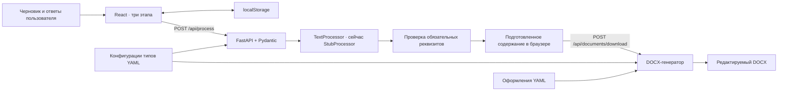

# Архитектура и API

Два приложения в одном репозитории: браузерный интерфейс и Python API. Отдельные сервисы хранения и LLM в каркасе не нужны. Ядро легко запускать и проверять без UI.



## Границы модулей

`schemas.py` определяет транспортный контракт. Неизвестные свойства, пустой черновик, недопустимые XML-символы и слишком большие значения отклоняются. Максимум черновика — 20 000 символов, реквизита — 500. Отдельная проверка допускает только реквизиты выбранного типа.

`processing.py` содержит заменяемый `TextProcessor`. Заглушка возвращает каждую непустую строку без замены слов, не извлекает реквизиты и не добавляет даты или имена. Пустые строки опускаются; отступы и слова внутри непустых строк остаются. `changes` пуст, `warnings` явно сообщает о режиме. `UnavailableProcessor` позволяет воспроизвести отказ, не меняя API-контракт.

`catalog.py` загружает YAML при запуске и кэширует только конфигурации. Это **не кэш LLM**. Старт приложения падает на некорректных конфигурациях, чтобы ошибка не проявлялась в середине пользовательского сценария.

`docx_generator.py` применяет порядок блоков из типа и оформление из шаблона. Генератор не обращается к модели. Заголовки и подписи полей — статическая структура; значения приходят от пользователя или заменяются меткой. Файл состоит из текстовых абзацев, не из изображений. Колонтитулы в стартовых оформлениях отсутствуют.

`frontend/src/api.ts` — единственная точка HTTP-запросов. Таймаут — 30 секунд. Сохранение формы не зависит от успешности API. Смена типа сохраняет реквизиты предыдущего типа в локальном состоянии, чтобы при возвращении они не терялись. Формы и просмотр строятся из каталога.

## Контракт API

Полная машиночитаемая схема — `GET /openapi.json`; интерактивная документация — `/docs`.

| Метод и путь | Назначение |
| --- | --- |
| `GET /api/health` | Состояние API и `processor_mode`; `ok` не означает доступность обработки |
| `GET /api/catalog` | `doc_types`, `templates`, `processor_mode` |
| `POST /api/process` | Черновик и реквизиты → подготовленное содержание, пропуски, изменения, предупреждения |
| `POST /api/documents/download` | Подготовленное содержание + оформление → бинарный DOCX |

Пример подготовки:

```json
{
  "doc_type": "service_memo",
  "draft": "Прошу согласовать закупку двух мониторов.",
  "requisites": { "subject": "О закупке мониторов" }
}
```

Форма ответа:

```json
{
  "document": {
    "doc_type": "service_memo",
    "requisites": { "subject": "О закупке мониторов" },
    "body": ["Прошу согласовать закупку двух мониторов."]
  },
  "missing_fields": [
    { "id": "recipient", "label": "Кому", "required": true },
    { "id": "sender", "label": "От кого", "required": true },
    { "id": "date", "label": "Дата", "required": true },
    { "id": "signer", "label": "Подписант", "required": true }
  ],
  "changes": [],
  "warnings": ["Демонстрационный режим: текст перенесён без исправлений. Проверка орфографии и делового стиля пока не подключена."],
  "processor_mode": "stub"
}
```

Для скачивания отправьте объект `document` из ответа и выбранное оформление:

```json
{
  "document": {
    "doc_type": "service_memo",
    "requisites": { "subject": "О закупке мониторов" },
    "body": ["Прошу согласовать закупку двух мониторов."]
  },
  "template_id": "classic"
}
```

Ответ имеет DOCX media type и `Content-Disposition: attachment`. Отдельного URL файла или серверной сессии нет. Поэтому пересоздание DOCX в другом оформлении не вызывает обработчик даже при его недоступности.

Экспорт проверяет структуру запроса, но не происхождение фактов: принимает присланное пользователем содержание как ввод. В нём нет подтверждения, что документ проходил ИИ-проверку. Если команда добавит заверенные результаты, понадобится серверное хранение результата с идентификатором или подписью.

Ошибки: `422` — неверные данные/тип/оформление; `503` — недоступность обработчика. Текст ошибки находится в `detail`; для стандартных ошибок Pydantic это массив деталей. UI показывает строку либо общее понятное сообщение, сохраняя форму.

## Как подключать LLM

Будущий путь: исходник → независимое извлечение фактов → запрос модели → JSON `requisites`, `body`, `changes` → Pydantic → сверка с исходником и ответами пользователя → обязательные реквизиты → генерация.

1. Добавить адаптер с таймаутом за `TextProcessor` и настройки в `settings.py`. Сетевой контракт и ошибки не должны попадать в генератор.
2. Перенести режим и сообщения результата из текущей заглушки в общий контракт обработки. Сейчас успешный ответ намеренно маркируется `stub`.
3. Валидировать не только форму JSON, но и происхождение непустых реквизитов и фактов. Одного совпадения чисел недостаточно для сохранения смысла и условий.
4. Неподтверждённые сведения обнулять/помечать. Разрешить максимум один повтор для нарушенной схемы или новых фактов; при повторном сбое возвращать явную ошибку.
5. Добавить ограниченный кэш по хэшу черновика, типа и ответов пользователя. Оформление в ключ не включать.
6. Не включать исправление текста в основной режим, пока тесты фактов, ошибок и схемы не пройдут.

Интерфейс хранит успешный результат только до изменения содержания или перезагрузки. Это небольшая локальная оптимизация, не замена будущему серверному кэшу.
