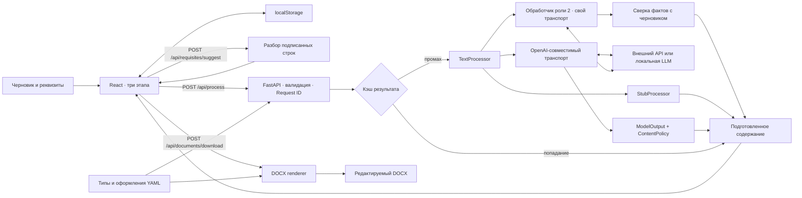

# Архитектура

Роль 1 предоставляет один FastAPI backend, единый контракт, транспорт LLM и запуск Docker Compose. React и DOCX-генератор уже подключены к этому backend. Участникам не нужно поднимать отдельные сервисы ради реализации своих модулей.

## Границы модулей

| Модуль | Ответственность |
| --- | --- |
| `backend/app/main.py` | Сборка приложения и зависимостей, маршруты, ошибки, Request ID, CORS, готовность |
| `backend/app/schemas.py` | Внешние Pydantic-контракты и ограничения входа |
| `backend/app/settings.py` | Чтение `.env`, проверка параметров и выбор режима |
| `backend/app/processing.py` | Интерфейс обработки, общий результат, обязательные реквизиты |
| `backend/app/llm.py` | Штатный OpenAI-совместимый транспорт режима `openai` |
| `backend/app/llm_processor.py` | Обработчик роли 2 режима `llm` и его адаптер к общей границе |
| `backend/app/extraction.py` | Разбор подписанных строк черновика в реквизиты |
| `backend/app/dates.py` | Образцы дат, общие для разбора и сверки фактов |
| `backend/app/cache.py` | Ограниченный кэш подготовленного содержания |
| `backend/app/errors.py` | Единый формат ошибок, Request ID |
| `backend/app/content_policy.py` | JSON-ответ модели и заменяемая политика проверки содержания |
| `backend/app/ports.py` | Интерфейс DOCX renderer |
| `backend/app/catalog.py` | Чтение и проверка типов/оформлений YAML |
| `backend/app/docx_generator.py` | Генерация DOCX из содержания, структуры типа и оформления |
| `frontend/src/api.ts` | HTTP-вызовы, сообщения об ошибке и скачивание |
| `contracts/` | Экспортированные OpenAPI, JSON Schema ответа модели и типы TypeScript |

Точное подключение модулей описано в [HANDOFF.md](HANDOFF.md), запросы и ограничения — в [API.md](API.md).

## Обработка текста

`stub` переносит каждую непустую строку без замены слов, не извлекает реквизиты и не добавляет факты. `unavailable` воспроизводит отказ. `openai` выполняет реальный HTTP-запрос к OpenAI-совместимому `/chat/completions`: использует URL, модель, ключ, таймаут и лимит ответа из настроек.

Ответ модели проходит строгий `ModelOutput`, затем `ContentPolicy`. По умолчанию политика разрешает только точное сохранение непустых строк исходника и введённых реквизитов. Это позволяет подключить и проверить транспорт, не выдавая непроверенное переформулирование за безопасный результат. Исправление стиля, независимое извлечение и сверка фактов относятся к роли 2 и подключаются через собственную политику.

При неверном JSON, нарушении схемы или политики разрешён максимум один исправляющий запрос, если `LLM_MAX_RETRIES=1`. Ошибка сети или HTTP не запускает автоматический повтор. Ошибки провайдера преобразуются в общий API-контракт; подробный ответ провайдера и ключ API не возвращаются клиенту.

## Режим `llm`: обработчик роли 2

`openai` проверяет транспорт при штатной политике сохранения исходника, а `llm` включает
содержательную обработку роли 2 со своим транспортом. Путь: исходник → независимое
извлечение фактов → запрос модели → JSON `requisites`, `body`, `changes` → Pydantic →
сверка с исходником и ответами пользователя → обязательные реквизиты → генерация.

1. Обработчик вызывает `/chat/completions` с `response_format: json_object` и собственным
   таймаутом. Сетевой контракт не покидает модуль: адаптер отдаёт наружу общий
   `ProcessorUnavailable` с кодом и статусом, а текст ответа провайдера клиенту не уходит.
2. Ответ разбирается даже с пояснениями и markdown-ограждением вокруг JSON, затем
   проверяется схемой `requisites`/`body`/`changes` и контрактом `DocumentContent`.
3. `extract_facts` сводит даты, числа и имена к сравнимому виду: `25.09.2026` и
   «25 сентября 2026» равны, «30 000» равно «30000» и «тридцать тысяч», фамилия сравнивается
   с точностью до падежа, нумерация списка фактом не считается. Сокращение имени до
   инициалов разрешено, раскрытие инициалов в полное имя — нет.
4. Нарушение схемы или новые факты дают ровно один повтор с указанием причины. После
   повтора неподтверждённый реквизит обнуляется и уходит в `missing_fields`,
   неподтверждённые сведения в тексте помечаются предупреждением, а сломанный JSON даёт
   явную ошибку с кодом `llm_invalid_output`.
5. Черновик длиннее окна модели режется на части по абзацам, части обрабатываются по
   очереди и собираются в один документ: реквизит берётся первый непустой, текст идёт
   подряд. Иначе сервер модели молча отбрасывает начало черновика — это проверено на живой
   Ollama с окном 4096 токенов.
6. Кроме чисел и дат сверяются условия и отрицания («если», «только», «не позднее», «не»).
   Переформулировка допустима, исчезновение оговорки даёт предупреждение о смысле.
7. Проверка работает в обе стороны: выдуманные сведения помечаются, пропавшие из текста
   числа и даты — тоже. Имена в обратную проверку не входят, потому что
   «Иванов И. И. просит...» законно становится «Прошу...».
8. Реквизит с `summary: true` в конфигурации типа (сейчас это только тема) модель
   формулирует по смыслу черновика; остальные поля она заполняет лишь там, где они названы
   прямо.
9. Ответы пользователя приоритетнее значений модели и никогда ими не перезаписываются.

Обработчик держит свою память частей черновика: ключ — тип документа, текст части и ответы
пользователя. Правка одного абзаца отправляет в модель только изменённую часть. Это память
внутри обработчика, отдельная от общего кэша результата, описанного ниже.

Чего в режиме нет: потоковой выдачи и оценки качества на длинных документах. Сверка
остаётся приблизительной: она ловит числа, даты, фамилии и исчезновение оговорок, но не
ловит подмену смысла при тех же словах. Пример с живого прогона: «30 000 рублей»
превратилось в «30 000 рублей за единицу», и ни одна проверка этого не заметила.

## Кэш и хранение

Успешная обработка сохраняется в ограниченном кэше в памяти процесса. Ключ учитывает черновик, тип и реквизиты; оформление в ключ не входит. Размер и время жизни задаются `CACHE_MAX_ENTRIES` и `CACHE_TTL_SECONDS`. Значение `0` у любого из них отключает кэш. Ошибки не кэшируются. `X-Cache` показывает `HIT`, `MISS` или `BYPASS`.

Кэш принадлежит конкретному экземпляру приложения: перезапуск его очищает, несколько процессов или реплик не делят записи между собой. Для общего кэша команда может позднее добавить внешнее хранилище. Одновременная обработка ограничивается `MAX_CONCURRENT_PROCESSES`.

DOCX создаётся в памяти запроса и сразу отдаётся клиенту. Серверной истории, базы документов и постоянного файлового хранилища нет. Черновик, выбранное оформление и реквизиты каждого типа сохраняет браузер в localStorage; успешный результат обработки в нём не сохраняется. Серверный кэш временно содержит подготовленный текст.

## Генерация DOCX

Скачивание получает `document` и `template_id`, не вызывает модель и не требует живого LLM. Смена оформления повторно использует уже подготовленное содержание. YAML типа задаёт реквизиты и порядок блоков, YAML оформления — шрифты, поля, интервалы и выравнивание.

Неизвестные реквизиты отклоняются. Пустые обязательные поля получают `[Заполнить: название поля]`, необязательные пропускаются. Генератор не придумывает дату, номер или подписанта. Текст записывается редактируемыми абзацами.

Порядок блоков и `placement` реквизитов задаёт тип, оформление — шаблон. Соседние реквизиты с одинаковым `placement` объединяются: дата и номер — в одну строку, должность и расшифровка — в подпись. Шаблон решает, куда попадают организация (верхний колонтитул или начало страницы) и адресат (блок или таблица «Кому / От кого»), что стоит в нижнем колонтитуле (номер страницы или название документа с датой) и как выровнена подпись. Вид документа, префиксы вроде «№ » и подписи полей — статическая структура; значения приходят от пользователя или заменяются меткой и переносятся в файл символ в символ. Стили используют шрифт шаблона без шрифтов темы Word, язык документа — русский. Файл состоит из текстовых абзацев и одной таблицы адресата в «Современном регламентном», без изображений.

Экспорт валидирует переданное содержание, но не удостоверяет его происхождение: пользователь может вызвать скачивание напрямую. Если потребуется доказательство прохождения фактчекинга, нужен идентификатор сохранённого результата или подпись.

## Запуск и наблюдение

Docker Compose поднимает backend и nginx с собранным frontend. Браузер обращается к `/api` того же адреса; nginx перенаправляет запросы в backend. При разработке эту задачу выполняет Vite. Для отдельного frontend-домена настраивается разрешённый список CORS.

`/api/health` проверяет жизнь API. `/api/ready` показывает локальную готовность выбранного обработчика, без платного вызова модели. Доступность сети, наличие модели у провайдера и правильность ключа проверяются реальным `/api/process`.

Ответы имеют `X-Request-ID`; ошибки дополнительно содержат этот идентификатор в JSON. Он позволяет сопоставить запрос клиента с серверной диагностикой. LLM и проверка DOCX вынесены за заменяемые границы, поэтому тесты можно выполнять без сети и ключей.

Это среда локальной разработки и демонстрации. Для публичного размещения отдельно нужны правила доступа, ограничения частоты запросов и решение о хранении данных. Без роли 2 нельзя заявлять завершённую проверку смысла, а соответствие оформлений эталонам и визуальная проверка относятся к роли 3.
