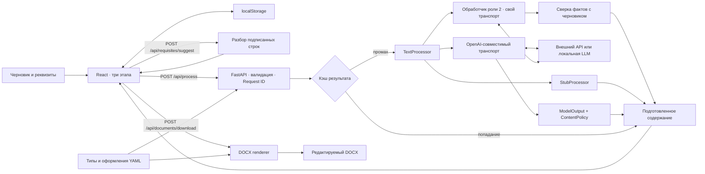
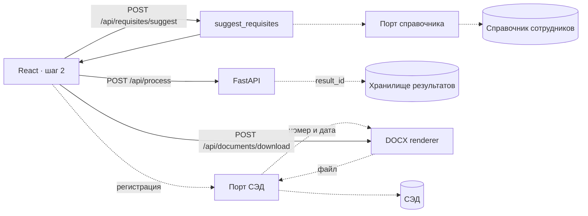

# Архитектура

Роль 1 предоставляет один FastAPI backend, единый контракт, транспорт LLM и запуск Docker Compose. React и DOCX-генератор уже подключены к этому backend. Участникам не нужно поднимать отдельные сервисы ради реализации своих модулей.



## Границы модулей

| Модуль | Ответственность |
| --- | --- |
| `backend/app/main.py` | Сборка приложения и зависимостей, маршруты, ошибки, Request ID, CORS, готовность |
| `backend/app/schemas.py` | Внешние Pydantic-контракты и ограничения входа |
| `backend/app/settings.py` | Чтение `.env`, проверка параметров и выбор режима |
| `backend/app/processing.py` | Интерфейс обработки, общий результат, обязательные реквизиты |
| `backend/app/llm.py` | Штатный OpenAI-совместимый транспорт режима `openai` |
| `backend/app/llm_processor.py` | Обработчик роли 2 режима `llm` и его адаптер к общей границе |
| `backend/app/extraction.py` | Разбор подписанных строк черновика в реквизиты |
| `backend/app/dates.py` | Образцы дат, общие для разбора и сверки фактов |
| `backend/app/cache.py` | Ограниченный кэш подготовленного содержания |
| `backend/app/errors.py` | Единый формат ошибок, Request ID |
| `backend/app/content_policy.py` | JSON-ответ модели и заменяемая политика проверки содержания |
| `backend/app/ports.py` | Интерфейс DOCX renderer |
| `backend/app/catalog.py` | Чтение и проверка типов/оформлений YAML |
| `backend/app/docx_generator.py` | Генерация DOCX из содержания, структуры типа и оформления |
| `frontend/src/api.ts` | HTTP-вызовы, сообщения об ошибке и скачивание |
| `contracts/` | Экспортированные OpenAPI, JSON Schema ответа модели и типы TypeScript |

Точное подключение модулей описано в [HANDOFF.md](HANDOFF.md), запросы и ограничения — в [API.md](API.md).

## Обработка текста

`stub` переносит каждую непустую строку без замены слов, не извлекает реквизиты и не добавляет факты. `unavailable` воспроизводит отказ. `openai` выполняет реальный HTTP-запрос к OpenAI-совместимому `/chat/completions`: использует URL, модель, ключ, таймаут и лимит ответа из настроек.

Ответ модели проходит строгий `ModelOutput`, затем `ContentPolicy`. По умолчанию политика разрешает только точное сохранение непустых строк исходника и введённых реквизитов. Это позволяет подключить и проверить транспорт, не выдавая непроверенное переформулирование за безопасный результат. Исправление стиля, независимое извлечение и сверка фактов относятся к роли 2 и подключаются через собственную политику.

При неверном JSON, нарушении схемы или политики разрешён максимум один исправляющий запрос, если `LLM_MAX_RETRIES=1`. Ошибка сети или HTTP не запускает автоматический повтор. Ошибки провайдера преобразуются в общий API-контракт; подробный ответ провайдера и ключ API не возвращаются клиенту.

## Режим `llm`: обработчик роли 2

`openai` проверяет транспорт при штатной политике сохранения исходника, а `llm` включает
содержательную обработку роли 2 со своим транспортом. Путь: исходник → независимое
извлечение фактов → запрос модели → JSON `requisites`, `body`, `changes` → Pydantic →
сверка с исходником и ответами пользователя → обязательные реквизиты → генерация.

1. Обработчик вызывает `/chat/completions` с `response_format: json_object` и собственным
   таймаутом. Сетевой контракт не покидает модуль: адаптер отдаёт наружу общий
   `ProcessorUnavailable` с кодом и статусом, а текст ответа провайдера клиенту не уходит.
2. Ответ разбирается даже с пояснениями и markdown-ограждением вокруг JSON, затем
   проверяется схемой `requisites`/`body`/`changes` и контрактом `DocumentContent`.
3. `extract_facts` сводит даты, числа и имена к сравнимому виду: `25.09.2026` и
   «25 сентября 2026» равны, «30 000» равно «30000» и «тридцать тысяч», фамилия сравнивается
   с точностью до падежа, нумерация списка фактом не считается. Сокращение имени до
   инициалов разрешено, раскрытие инициалов в полное имя — нет.
4. Нарушение схемы или новые факты дают ровно один повтор с указанием причины. После
   повтора неподтверждённый реквизит обнуляется и уходит в `missing_fields`,
   неподтверждённые сведения в тексте помечаются предупреждением, а сломанный JSON даёт
   явную ошибку с кодом `llm_invalid_output`.
5. Черновик длиннее окна модели режется на части по абзацам, части обрабатываются по
   очереди и собираются в один документ: реквизит берётся первый непустой, текст идёт
   подряд. Иначе сервер модели молча отбрасывает начало черновика — это проверено на живой
   Ollama с окном 4096 токенов.
6. Кроме чисел и дат сверяются условия и отрицания («если», «только», «не позднее», «не»).
   Переформулировка допустима, исчезновение оговорки даёт предупреждение о смысле.
7. Проверка работает в обе стороны: выдуманные сведения помечаются, пропавшие из текста
   числа и даты — тоже. Имена в обратную проверку не входят, потому что
   «Иванов И. И. просит...» законно становится «Прошу...».
8. Реквизит с `summary: true` в конфигурации типа (сейчас это только тема) модель
   формулирует по смыслу черновика; остальные поля она заполняет лишь там, где они названы
   прямо.
9. Ответы пользователя приоритетнее значений модели и никогда ими не перезаписываются.

Обработчик держит свою память частей черновика: ключ — тип документа, текст части и ответы
пользователя. Правка одного абзаца отправляет в модель только изменённую часть. Это память
внутри обработчика, отдельная от общего кэша результата, описанного ниже.

Чего в режиме нет: потоковой выдачи и оценки качества на длинных документах. Сверка
остаётся приблизительной: она ловит числа, даты, фамилии и исчезновение оговорок, но не
ловит подмену смысла при тех же словах. Пример с живого прогона: «30 000 рублей»
превратилось в «30 000 рублей за единицу», и ни одна проверка этого не заметила.

## Кэш и хранение

Успешная обработка сохраняется в ограниченном кэше в памяти процесса. Ключ учитывает черновик, тип и реквизиты; оформление в ключ не входит. Размер и время жизни задаются `CACHE_MAX_ENTRIES` и `CACHE_TTL_SECONDS`. Значение `0` у любого из них отключает кэш. Ошибки не кэшируются. `X-Cache` показывает `HIT`, `MISS` или `BYPASS`.

Кэш принадлежит конкретному экземпляру приложения: перезапуск его очищает, несколько процессов или реплик не делят записи между собой. Для общего кэша команда может позднее добавить внешнее хранилище. Одновременная обработка ограничивается `MAX_CONCURRENT_PROCESSES`.

DOCX создаётся в памяти запроса и сразу отдаётся клиенту. Серверной истории, базы документов и постоянного файлового хранилища нет. Черновик, выбранное оформление и реквизиты каждого типа сохраняет браузер в localStorage; успешный результат обработки в нём не сохраняется. Серверный кэш временно содержит подготовленный текст.

## Генерация DOCX

Скачивание получает `document` и `template_id`, не вызывает модель и не требует живого LLM. Смена оформления повторно использует уже подготовленное содержание. YAML типа задаёт реквизиты и порядок блоков, YAML оформления — шрифты, поля, интервалы и выравнивание.

Неизвестные реквизиты отклоняются. Пустые обязательные поля получают `[Заполнить: название поля]`, необязательные пропускаются. Генератор не придумывает дату, номер или подписанта. Текст записывается редактируемыми абзацами.

Порядок блоков и `placement` реквизитов задаёт тип, оформление — шаблон. Соседние реквизиты с одинаковым `placement` объединяются: дата и номер — в одну строку, должность и расшифровка — в подпись. Шаблон решает, куда попадают организация (верхний колонтитул или начало страницы) и адресат (блок или таблица «Кому / От кого»), что стоит в нижнем колонтитуле (номер страницы или название документа с датой) и как выровнена подпись. Вид документа, префиксы вроде «№ » и подписи полей — статическая структура; значения приходят от пользователя или заменяются меткой и переносятся в файл символ в символ. Стили используют шрифт шаблона без шрифтов темы Word, язык документа — русский. Файл состоит из текстовых абзацев и одной таблицы адресата в «Современном регламентном», без изображений.

Экспорт валидирует переданное содержание, но не удостоверяет его происхождение: пользователь может вызвать скачивание напрямую. Если потребуется доказательство прохождения фактчекинга, нужен идентификатор сохранённого результата или подпись.

## Интеграция с внешними системами

**Не реализовано.** В коде нет ни справочника сотрудников, ни передачи в СЭД. Ниже описана схема подключения к существующим границам. Имена новых портов, моделей и маршрутов условные.



Пунктиром показаны связи, которых пока нет.

### Справочник сотрудников и подразделений

**Где подключается.** Справочник подключается там же, где разбор черновика: `POST /api/requisites/suggest` → `suggest_requisites` (`backend/app/extraction.py`). Это подсказка для формы до обработки, модель в ней не участвует. Frontend (`frontend/src/App.tsx`) подставляет подсказку только в пустое поле, а введённое пользователем значение не перезаписывает. Справочник даёт значения для `recipient`, `sender` и `signer`, а вместе с `signer` — и для `signer_position`. `sender` есть только у служебной и докладной записок.

Используются два сценария:

- в черновике указано «Кому: Иванову». Имя, найденное `suggest_requisites`, ищется в справочнике. Если нашлась ровно одна запись, в подсказку идут полное имя и должность. Если записей несколько или ни одной, остаётся значение из черновика: выбирать за пользователя нельзя, как и в остальном разборе;
- на шаге 2 пользователь начинает вводить фамилию и получает варианты из отдельного маршрута поиска (условно `GET /api/directory/search`).

**Контракт адаптера.** Порт — `Protocol` в `backend/app/ports.py`, рядом с `DocumentRenderer`:

```python
class StaffDirectory(Protocol):
    def search(self, query: str, *, limit: int) -> list[DirectoryEntry]: ...
```

У `DirectoryEntry` поля `id`, `full_name`, `position`, `department`. Адаптер конкретного справочника (LDAP, выгрузка кадровой системы, HTTP API) превращает ответ источника в эти записи и больше ничего не делает. Из записи в реквизит значение переносит backend. Результат проходит те же ограничения, что и ручной ввод: ключи проверяет `validate_requisite_keys`, длину — `ShortText` (до 500 символов). Справочник хранит имена в именительном падеже, а «Кому» пишется в дательном. Эту форму даёт либо поле справочника, либо пользователь правит её в форме.

Значение из справочника попадает в `ProcessRequest.requisites` так же, как введённое вручную. Обработчик считает его ответом пользователя и не перезаписывает (пункт 9 раздела о режиме `llm`).

**Справочник недоступен.** Разбор черновика от справочника не зависит:

- адаптер вызывается с коротким собственным таймаутом, заметно меньше 60 секунд, которые frontend ждёт ответа `suggest`;
- если адаптер упал или не ответил, `/api/requisites/suggest` возвращает то, что нашёл `suggest_requisites`, а не ошибку;
- маршрут поиска отвечает `503` с `retryable: true` в общем формате `ErrorResponse`;
- поля остаются доступными для ручного ввода. Frontend уже так ведёт себя при ошибке `suggest`: `.catch` в `App.tsx` оставляет форму как есть;
- `/api/ready` не падает из-за справочника, потому что это необязательная функция. Состояние справочника можно отдать новым ключом в `ReadyResponse.checks`, схема `dict[str, bool]` это уже допускает.

### Передача готового DOCX в СЭД

**Сейчас.** `POST /api/documents/download` собирает DOCX в памяти из `DocumentContent`, который прислал клиент, и ничего не сохраняет. Как сказано выше, экспорт не удостоверяет происхождение содержания. Для СЭД этого мало: зарегистрированный документ нужно связать с конкретным результатом обработки и его предупреждениями.

**Точка подключения** — отдельный маршрут после скачивания, условно `POST /api/documents/register`. Сам `download` не меняется: он по-прежнему нужен для просмотра и сохранения файла у пользователя. Для регистрации нужно добавить три вещи.

1. **Идентификатор сохранённого результата.** `/api/process` записывает `ProcessResponse` (содержание, `changes`, `warnings`, `processor_mode`, `X-Request-ID`, время) в постоянное хранилище и возвращает `result_id`. Кэш из `backend/app/cache.py` для этого не годится: у него есть время жизни, перезапуск его очищает, реплики его не делят. Запрос регистрации передаёт `result_id`, итоговый `DocumentContent` и `template_id`. Сервер сравнивает содержание с сохранённым. Если после обработки пользователь правил текст, в метаданных появляется отметка о ручной правке. Прохождение сверки фактов подтверждается только для неизменённого результата.
2. **Метаданные карточки СЭД:** `doc_type`, `subject`, `recipient`, `sender`, `signer`, `template_id`, `processor_mode`, `warnings`, `result_id`, `X-Request-ID`. Если значение выбрано из справочника, к нему добавляется `id` записи справочника.
3. **Регистрационный номер из внешней нумерации.** Номер и дату присваивает СЭД при регистрации, поэтому порядок такой: регистрация карточки → СЭД возвращает номер и дату → backend записывает их в реквизиты `number` и `date` → renderer собирает DOCX → файл прикрепляется к карточке. Номер печатается в строке `registration`, поэтому файл собирается после регистрации. Модель при этом не вызывается, повторная сборка дешёвая и детерминированная. Номер и дата из СЭД заменяют введённые вручную, и ответ маршрута об этом сообщает.

Порт в `backend/app/ports.py`:

```python
class DocumentRegistry(Protocol):
    def register(self, card: RegistrationCard, *, idempotency_key: str) -> Registration: ...
    def attach(self, registration_id: str, content: bytes, filename: str) -> None: ...
```

У `Registration` поля `registration_id`, `number`, `date`. Ключ идемпотентности — `result_id`: повтор после таймаута не регистрирует документ дважды. Если СЭД недоступна, маршрут отвечает `503` с `retryable: true`, документ отправленным не считается, а скачанный файл у пользователя остаётся. Хранилище результатов подключается третьим портом того же вида: `save(...) -> result_id` и `get(result_id)`.

### Что меняется в контрактах

Остаётся прежним:

- `DraftInput`, `ProcessRequest`, `DocumentContent`, `DownloadRequest` и поведение трёх существующих маршрутов обработки;
- `TextProcessor` и сигнатура `DocumentRenderer` `(content, doc_type, template) -> bytes`;
- YAML типов и оформлений: поля `recipient`, `sender`, `signer`, `signer_position`, `number` и `date` в них уже есть;
- формат ошибок `ErrorResponse`.

Добавляется в `backend/app/schemas.py` (только новые необязательные поля и новые модели):

- `ProcessResponse.result_id: str | None`. Поле заполняется, только если подключено хранилище;
- `RequisiteSuggestions.sources` — откуда взято значение: из черновика или из справочника. Сейчас `frontend/src/components/OptionsStep.tsx` отделяет поля, найденные в черновике, от незаполненных. С этим полем он сможет показать и источник значения;
- модели `DirectoryEntry`, `RegistrationRequest` (`result_id`, `document`, `template_id`), `RegistrationCard` и `Registration`.

Все контракты наследуют `Contract` с `extra="forbid"`, поэтому новые поля запросов должны быть необязательными: иначе старые клиенты получат `422`. После правки схем `scripts/export_contracts.py` заново выпускает `contracts/openapi.json`, `contracts/api.ts` и `frontend/src/generated/api.ts`, а флаг `--check` находит устаревшие копии.

Реализации портов лежат в отдельных модулях. Подключаются они в `create_app` (`backend/app/main.py`) именованными аргументами, как сейчас `renderer`. Значение `None` означает, что интеграция выключена: новые маршруты не регистрируются, остальное работает как сейчас. Клиент уже считает ответ `404`/`405` необязательного маршрута отсутствием функции (параметр `optional` в `frontend/src/api.ts`). Адреса и учётные данные внешних систем добавляются новыми параметрами `Settings`. Сборку с адаптерами запускает собственный модуль, указанный в `APP_MODULE`, без правок маршрутов и Dockerfile.

## Запуск и наблюдение

Docker Compose поднимает backend и nginx с собранным frontend. Браузер обращается к `/api` того же адреса; nginx перенаправляет запросы в backend. При разработке эту задачу выполняет Vite. Для отдельного frontend-домена настраивается разрешённый список CORS.

`/api/health` проверяет жизнь API. `/api/ready` показывает локальную готовность выбранного обработчика, без платного вызова модели. Доступность сети, наличие модели у провайдера и правильность ключа проверяются реальным `/api/process`.

Ответы имеют `X-Request-ID`; ошибки дополнительно содержат этот идентификатор в JSON. Он позволяет сопоставить запрос клиента с серверной диагностикой. LLM и проверка DOCX вынесены за заменяемые границы, поэтому тесты можно выполнять без сети и ключей.

Это среда локальной разработки и демонстрации. Для публичного размещения отдельно нужны правила доступа, ограничения частоты запросов и решение о хранении данных. Без роли 2 нельзя заявлять завершённую проверку смысла, а соответствие оформлений эталонам и визуальная проверка относятся к роли 3.
